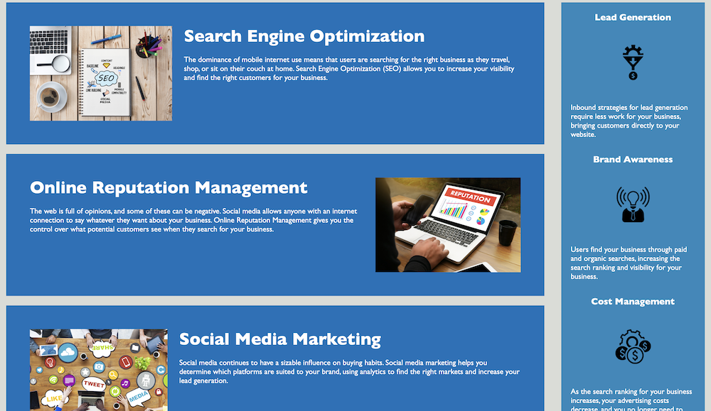

# Marketing-Project

## Description

Updated the Horiseon homepage to be more accessible. To do this we have added alt tags and semantic HTML selements. 

Because the hero image in the element takes up suck a large portion of the page, I added an aria label to assign it an alt tag that can be read by a screen reader. 

I have also updated the title of the webpage and made minor formatting changes to the Heading attributes. 

## Screenshot

## Credits

To add the alt tag to the hero image, i followed this resource about aria tags. 
https://web.archive.org/web/20160728160132/https://developer.yahoo.com/blogs/ydn/restoring-semantics-accessibility-aria-while-optimizing-mobile-performance-52427.html

---

